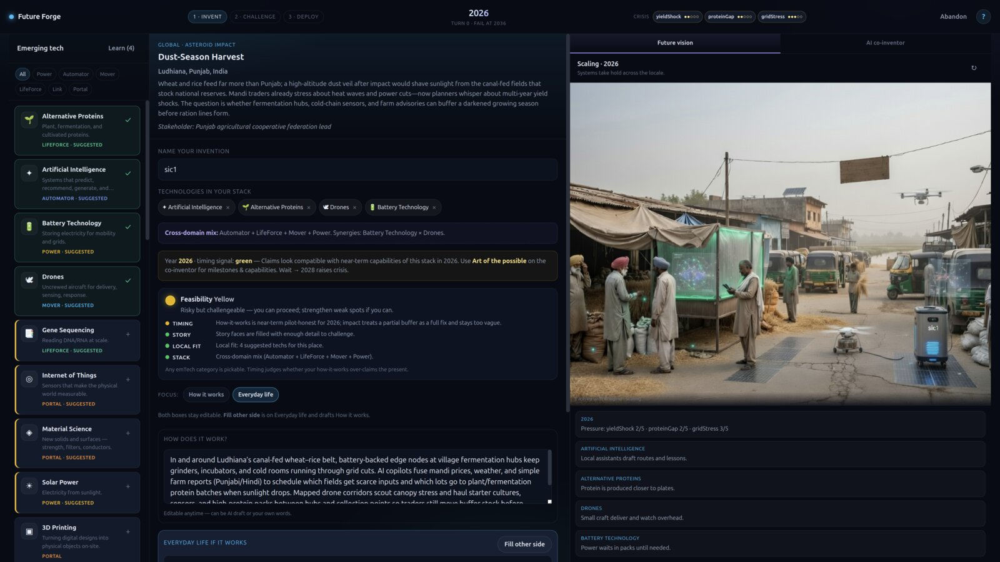

# Future Forge

**Invent local pathways with emerging technologies — place them on a hex board as the future arrives with an AI co-inventor.**

Future Forge is an inventing practice. You pick a global problem, land in a concrete place, invent with emerging tech on a hexagonal pathway board, summon the hard questions onto that board, and hold the pathway before the local crisis collapses.

**About & learning goals:** Future Forge is an [inventing practice](docs/what-is-future-forge.md) — origin (6Ps tabletop), design contradiction, Progress and Predictions, and what learners practice today.

**Hex invent surface:** [docs/workshop-hex-invent-surface.md](docs/workshop-hex-invent-surface.md)



*Invent screen: emTech tray, hex pathway board, crisis/concern traffic lights, future vision, and AI co-inventor.*

---

## How it works

1. **Theme** — Choose a global problem (climate, infectious disease, energy access, …).
2. **Local scenarios** — Read a short problem brief while Future Forge drafts several concrete places. Pick one mission (cached for next time; solved ones stay available).
3. **Invent on the hex board** — Pick emTechs from domains like Power, Automator, Mover, LifeForce, Link, and Portal. **Ask for ideas** (or write how it works) to mint invention tiles with AI art. Drag them onto the board. **Bits** (blue) and **atoms** (pink) faces must match to dock; converters (IoT, print, …) bridge both.
4. **Traffic lights** — Crisis meters start on the board. Neighboring inventions re-evaluate lamps (red / yellow / green). Looking at the board *is* the thinking.
5. **Hard questions** — When ready, summon all four challengers onto the board at once: **Moloch**, **Ethicist**, **Stakeholder**, **Mother Nature**. Ease their lights with honest ideas.
6. **Hold the pathway** — When every active light is yellow or green, declare the pathway holds. **Wait** advances the calendar and raises crisis. Fail if any meter hits 5 or the collapse year arrives.

**Learn** (tech tray) opens primers. The **AI co-inventor** brainstorms and tutors — you lead; it proposes.

---

## Requirements

- **Node.js** 18+ (ES modules). **Node 20.9+** if you enable Clerk learner accounts (`@clerk/backend`)
- Optional but recommended for full AI + vision:
  - **SuperGrok** session via Grok CLI (`grok login`), **or**
  - An **xAI API key** (`FF_XAI_API_KEY`)

Without either auth path, the practice still runs: static UI + a **local** co-inventor fallback (weaker, no live Grok).

---

## Install and run locally

```bash
git clone https://github.com/warmersun/future-forge.git
cd future-forge
npm install
npm start
```

Open **http://127.0.0.1:8765**

| Command | Purpose |
|--------|---------|
| `npm start` / `npm run serve` | **game** — Future Forge engine (`server.mjs`). No Clerk, no Neon. |
| `npm run portal` | **portal** — Cloud **APIs** only (`portal/server.mjs`). Clerk + Neon. No game UI. Render runs this. |
| `npm start -- --usage` | game with AI/session usage metrics writing to `data/usage/` |
| `npm run check:briefs` | Verify problem-brief coverage for all themes |
| `npm run validate:quest -- path.json` | Validate a Spotlight Quest tile JSON |
| `npm run author:quest -- --tech gene-sequencing --local-only` | Scaffold a spotlight Quest tile |

### Spotlight / External Quest tiles

AI agents (any harness) can research a recent emTech advance and author a portable **Quest tile** JSON. See `docs/quest-tile-schema.md` and the MIT skill package `skills/future-forge-quest/`.

**Server folder (recommended for classrooms / Friends):**

1. Put validated `.json` tiles in the **`quests/`** directory (next to `server.mjs`).
2. `npm start` — the server scans that folder and logs how many tiles loaded.
3. Learners see **External Quests** on the home screen and **first** when choosing a theme/Quest (including Friends). Cards use a gold “External” badge.
4. Override path: `FF_QUESTS_DIR=/path/to/folder npm start`. API: `GET /api/quests`.

**Browser import (per device):** title screen → **Import Quest…** (or drop a `.json`). Lands in **Library**. Example: `test/fixtures/quests/spotlight-gene-seq.json` (also copied under `quests/`).

**Share a lesson (X / open table):** catalog card → **Copy link**. That copies `https://warmersun.com/forge/?q=<quest-id>`. The hop forwards `?q=` onto the Funnel game host, and Future Forge starts that Quest. Learning lessons still need Sign in when Cloud is on. Do not post the `*.ts.net` URL.

Default port: **8765** (override with `FF_PORT`). **game** and **portal** both default to 8765 — do not run them at the same time. Render sets `PORT` for portal.

### Learner accounts (optional Clerk)

Sign-in is **optional**. Clerk UI runs on the hosted portal at **`https://cloud.warmersun.com/signin`**. Local **game** (`npm start` at `http://127.0.0.1:8765`) never loads Clerk; the Sign in chip opens the portal and stores a session JWT. Future Forge stays fully playable without an account. Hosted Warmer Sun Cloud on Render turns Clerk on so players have a stable identity (progress, quest boards, Continue).

This is **not** the same as xAI / SuperGrok credentials below (those are the AI provider for the co-inventor).

Set `FF_PORTAL_URL` on the game to the portal API origin (Render `https://….onrender.com` is fine). Production Clerk keys only load on `warmersun.com` (or a subdomain) — that is why Sign in is on `cloud.warmersun.com`, not on loopback.

```bash
cp .env.portal.example .env.portal   # gitignored — local portal / test keys only
# Render Dashboard holds pk_live_ / sk_live_
# If you set CLERK_AUTHORIZED_PARTIES it *replaces* defaults — include:
#   https://warmersun.com,https://cloud.warmersun.com,http://127.0.0.1:8765,http://localhost:8765
# Funnel / public game host (device handshake CORS; appends to loopback):
#   FF_GAME_DEVICE_ORIGINS=https://futureforge.xantu-chickadee.ts.net
```

| Endpoint | Behavior |
|----------|----------|
| `GET /api/health` | Public `clerk.enabled` + publishable key (never the secret) |
| `GET /api/me` | `{ signedIn: false }` unsigned; `{ userId }` when the session JWT is valid; `401` on a bad token |

In the Clerk Dashboard, add allowed origins for `https://cloud.warmersun.com` and `https://warmersun.com`. Google / X **Authorized JavaScript origins** are those same hosts (not loopback). If `FF_API_SECRET` is also set, send it as **`X-FF-Secret`** so it does not collide with the Clerk Bearer JWT.

Without these keys, `npm run portal` has no Sign in page. `npm start` (**game**) loads `.env` only and never reads Clerk keys. Unsigned play at `http://127.0.0.1:8765` still works.

### Optional environment

**game:** copy `.env.example` to `.env`. **portal:** copy `.env.portal.example` to `.env.portal`.

```bash
# .env
FF_PORT=8765
FF_XAI_MODEL=grok-4.6
# FF_XAI_API_KEY=xai-...   # see auth below
# FF_TTS_VOICE=eve         # optional default for Read out loud
```

---

## AI dependency: SuperGrok OAuth or xAI API key

The Node server serves static files and exposes:

- `POST /api/co-invent` — scenarios, co-inventor, feasibility assist, challenges  
- `POST /api/vision` — Imagine-based future vision images  
- `POST /api/tts` — cloud text-to-speech for **Read out loud** on long narrative text (xAI TTS; **server caches** audio by text+voice under `data/tts-cache/` so all users share one file; browser falls back to device voice if AI is offline on a cache miss)  
- `GET /api/health` — public co-inventor status (LAN IPs / models / room stats only on loopback or with admin token); **portal** also includes `clerk` + `db`  
- `GET /api/me` — **portal** only: Clerk learner identity (unsigned play still works)  
- `GET /api/usage` — AI token / image / TTS / session rollups (**loopback or `FF_ADMIN_TOKEN` only**)

**AI provider credentials** (SuperGrok / `FF_XAI_API_KEY`) are resolved **on game** (`npm start`) and never go to the browser. **portal** does not use them. **Learner accounts** use a Clerk session JWT in `Authorization: Bearer` when the player is signed in.

### Server hardening (static, rates, admin)

The process only serves **allowlisted public assets** (`index.html`, `css/`, client `js/`, `assets/`). It will not serve `.env`, `server.mjs`, `data/`, or other repo files over HTTP.

| Env | Purpose |
|-----|---------|
| `FF_TRUST_PROXY=1` | Use `X-Forwarded-For` for rate-limit keys (**only** behind a reverse proxy you control; off by default) |
| `FF_API_SECRET` | If set, expensive POST routes require `X-FF-Secret` or non-JWT `Authorization: Bearer` (loopback exempt). Prefer `X-FF-Secret` when Clerk is on. |
| `CLERK_PUBLISHABLE_KEY` / `CLERK_SECRET_KEY` | Optional learner accounts. Both required. |
| `FF_ADMIN_TOKEN` | Non-loopback access to `/api/usage` and detailed `/api/health` |
| `FF_MAX_ROOMS` | Cap concurrent friends rooms (default 200) |
| `FF_WS_MAX_PAYLOAD` | Max WebSocket message bytes (default 256KiB) |
| `FF_RATE_*` | Optional overrides for solo AI / WS action rate limits (see `.env.example`) |
| `FF_AI_SEARCH=1` | Live web + X search on timing assess and idea-sparks (off by default; also `--ai-search`) |

Solo AI routes (`/api/co-invent`, `/api/vision`, `/api/market-image`, `/api/tts`) share per-IP rate limits. Friends rooms also enforce action and AI flood limits on the WebSocket.

### Developer mode (quest / trend inspect)

**Off by default.** When on, the browser unlocks developer chrome (not automatic dump of all tiles). Production `npm start` must leave this off.

- **Quests:** **Developer** on catalog cards → inspect modal (markdown + JSON).
- **Trends:** Look Ahead stays stack-only until you click **Developer view** (then all catalog tiles; per-card **Developer** opens player chart + JSON). **Player view** returns to the normal stack charts.

```bash
npm start -- --developer
# or
npm run start:developer
# or
node server.mjs --developer
# or (deploy-friendly)
FF_DEVELOPER=1 npm start
```

Force off even if env is set: `node server.mjs --no-developer`. The client reads `developer` from `GET /api/health` — there is no URL or localStorage override.

### AI search (web + X on timing and idea sparks)

**Off by default.** When on, Grok may call xAI `web_search` and `x_search` for **timing assess** and **Ask for ideas** only (other co-invent modes stay closed-prompt). Search is slower and billed per tool call.

```bash
npm start -- --ai-search
# or
node server.mjs --ai-search
# or (deploy-friendly)
FF_AI_SEARCH=1 npm start
```

Force off even if env is set: `node server.mjs --no-ai-search`. `GET /api/health` reports `aiSearch`.

### Usage metrics (hosting cost estimates)

**Off by default.** Enable when you want token / image / TTS / session logs for cost estimates:

```bash
npm start -- --usage
# or
node server.mjs --usage
# or (deploy-friendly)
FF_USAGE_ENABLED=1 npm start
```

Force off even if env is set: `node server.mjs --no-usage`.

When enabled, the server writes under **`data/usage/`** (gitignored):

| File | Contents |
|------|----------|
| `events-YYYY-MM-DD.jsonl` | Append-only events (text tokens, image gens, TTS, sessions, rooms) |
| `summary.json` | Lifetime + UTC-day rollups, active sessions/rooms, optional `$` estimate |

Inspect live rollups:

```bash
# loopback only by default; from elsewhere pass admin token:
curl -s http://127.0.0.1:8765/api/usage | jq .
# curl -s -H "Authorization: Bearer $FF_ADMIN_TOKEN" https://your-host/api/usage | jq .
```

| Flag / env | Purpose |
|------------|---------|
| `--usage` / `--usage-tracking` | Enable metrics (CLI) |
| `--no-usage` | Force disable (wins over env) |
| `FF_USAGE_ENABLED=1` | Enable via environment |
| `FF_USAGE_DIR` | Override metrics directory |
| `FF_USAGE_PRICE_TEXT_IN_PER_MTOK` / `FF_USAGE_PRICE_TEXT_OUT_PER_MTOK` | Optional $ per 1M tokens |
| `FF_USAGE_PRICE_IMAGE` | Optional $ per live image generate/edit |
| `FF_USAGE_PRICE_TTS_PER_MCHAR` | Optional $ per 1M live TTS characters |

**Notes:** Cached vision frames, Friends follow-only peeks, and TTS cache hits are counted but **not** billed as live usage. Local co-inventor fallback records calls with **zero** tokens. Prompts and learner text are never stored. Assumes a single Node process (set distinct `FF_USAGE_DIR` per instance if you scale out).

### Option A — SuperGrok OAuth (default for local dev)

Use the same login as the Grok CLI:

```bash
grok login
```

This stores a session under `~/.grok/auth.json` (or `$FF_GROK_HOME/auth.json`). Future Forge reads and refreshes that session automatically.

**Best for:** local development on a machine where you already use SuperGrok.

### Option B — xAI API key

Create a key in the [xAI console](https://console.x.ai/) and set:

```bash
export FF_XAI_API_KEY=xai-...
# or put it in .env (never commit .env)
```

**Best for:** servers, CI, or machines without a SuperGrok desktop session.

### What happens if neither works

- The UI still loads.
- Co-inventor modes fall back to a **local** heuristic partner.
- Live Grok reasoning and Imagine vision will not run until auth succeeds.

Check the co-inventor status line in the UI, or:

```text
GET http://127.0.0.1:8765/api/health
```

---

## Project layout

```text
future-forge/
  server.mjs          # game — engine (static + co-inventor + Friends WS)
  portal/server.mjs   # portal — Warmer Sun Cloud (game + Clerk + Neon). Render runs this.
  render.yaml         # Render Blueprint for portal
  .env.example        # game env template → .env
  .env.portal.example # portal env template → .env.portal
  index.html          # app shell (shared)
  css/ styles.css
  js/                 # workshop loop, data, co-inventor client, vision, problem briefs
  js/cloud/           # browser-safe Cloud helpers
  assets/
    problems/         # theme card art
    challengers/      # Moloch, Ethicist, Stakeholder, Mother Nature
  docs/               # README images
  scripts/            # e.g. check-problem-briefs.mjs
```

Browser state lives in **localStorage** on the learner’s device: scenario cache, **solved mission ids** (including learning-module completion for the segment progress bar), quest library imports, and related UI prefs. Nothing is synced to warmersun.com by default — see [Privacy](https://warmersun.com/privacy/).

---

## Deploy (brief)

This is a **long-running Node process**, not a static-only site (unless you accept the local co-inventor only).

**Warmer Sun Cloud (portal)** is a Render **Web Service** of **HTTP APIs**, not the game. See `render.yaml`.

1. New Web Service on this repo. Build: `npm install`. Start: `npm run portal`.
2. Health check: `/api/health`. Bind uses Render’s `PORT` (do not hardcode 8765).
3. Dashboard env: Clerk keys, `DATABASE_URL` (+ unpooled), `FF_TRUST_PROXY=1`. No xAI.
4. Play the SPA on **game** (`npm start` at `http://127.0.0.1:8765`) with `FF_PORTAL_URL=https://<service>.onrender.com`. Sign in is **`https://cloud.warmersun.com/signin`**.
5. Clerk allowed origins / Google / X JS origins = `https://cloud.warmersun.com` and `https://warmersun.com`. `CLERK_AUTHORIZED_PARTIES` must include those plus loopback game origins if the env **replaces** defaults. Webhook URL is still the Render `/api/webhooks/clerk` until the custom domain is the webhook host too.
6. DNS: CNAME `cloud.warmersun.com` → the Render hostname; add the custom domain on Render. Cloudflare-proxied TLS is fine on this public host.

Do not run **game** and **portal** on the same port.

Do not commit secrets. Do not put API keys in the client or the git repo.

---

## License

**Future Forge** by **Warmer Sun Education, a sole proprietorship by Tamas Simon** (© 2026) is licensed under  
[**Creative Commons Attribution-NonCommercial-ShareAlike 4.0 International**](https://creativecommons.org/licenses/by-nc-sa/4.0/) (CC BY-NC-SA 4.0).

| Use | Free? |
|-----|--------|
| **Non-commercial** copy, share, adapt (with attribution + share-alike) | **Yes** — CC BY-NC-SA 4.0 ([`LICENSE.md`](LICENSE.md)) |
| **Host a meeting** (in person or online) where **you participate**; not charging for Future Forge | **Yes** — free grant in [`COMMERCIAL.md`](COMMERCIAL.md) |
| **Run an online server** with **no commercial intent** and **not charging** | **Yes** — free grant in [`COMMERCIAL.md`](COMMERCIAL.md) |
| **School / university / bootcamp / training org** | **No** — Education is commercial use; needs a paid license |
| **Company / commercial / client work** | **No** — needs a paid commercial license |
| **Paid cloud / multi-tenant / managed service** for others | **No** — needs a paid commercial license |

- Public license text and attribution: **[`LICENSE.md`](LICENSE.md)**  
- Deed: https://creativecommons.org/licenses/by-nc-sa/4.0/  
- Free grants + paid tiers (Education / Commercial / Cloud): **[`COMMERCIAL.md`](COMMERCIAL.md)**  
- Source: https://github.com/warmersun/future-forge  

If you are unsure, contact us — open a GitHub issue with subject **Commercial license**.

Content and art are development-time static assets; scenario text may be generated via the co-inventor when AI is available. AI providers’ terms apply to any keys you use.
