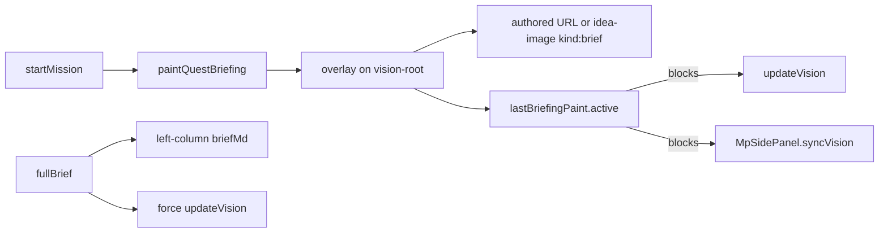

# Code review: visual quest briefing

Review of uncommitted work whose goal is a more visual, easier-to-digest quest brief. Scope is the working tree (new [`js/briefing-ui.js`](js/briefing-ui.js) / [`js/brief-beats.js`](js/brief-beats.js), plus [`js/game.js`](js/game.js), [`js/vision.js`](js/vision.js), [`js/multiplayer/ui.js`](js/multiplayer/ui.js), CSS, schema, and `/api/idea-image` `kind: "brief"`).

**Verdict:** The derive-from-`briefMd` path, URL allowlist, and VisionRenderer “don’t clobber briefing stills” guards are solid. The overlay-on-Future-Vision idea matches the goal. Do not ship as-is until the high-severity items below are fixed; several leftover pieces also undercut digestibility.

---

## High

### 1. `lastBriefingPaint().active` is process-global and too coarse

[`js/briefing-ui.js`](js/briefing-ui.js) stores one `lastPaint` for the whole page. [`js/game.js`](js/game.js) `updateVision` and [`js/multiplayer/mp-side.js`](js/multiplayer/mp-side.js) `syncVision` both bail out whenever that flag is true.

Effects:
- Challenge / deploy / outcome vision shares `updateVision`. An in-progress invent briefing freezes those frames even though their canvases are not `.is-briefing`.
- Solo `#vision-root` and MP `#mp-vision-root` / `#hs-vision-root` all live in the same document. Painting one walkthrough can stall the other mode’s Imagine until the overlay is dismissed.
- `activeWalkRecord()` correctly checks `offsetParent`, but the vision gates do not.

Gate on **this canvas** (`visionRoot.classList.contains("is-briefing")` or the record for that root), not a module singleton.

### 2. Live briefing stills assign Imagine `data:` URLs to `.vision-image`

[`js/briefing-ui.js`](js/briefing-ui.js) `applyCartoonFrame` sets `img.src` to whatever `/api/idea-image` returns. That route still returns huge `data:image…` payloads. [`js/vision.js`](js/vision.js) exists specifically to convert those to `blob:` because re-assigning data URLs freezes Chrome.

Authored `assets/…` and postcard fallbacks are fine. The default path (no `imageUrl` on a beat) is not. Convert via the same blob helper, or don’t put Imagine bytes on this `` at all.

### 3. Replay briefing on learning quests stays in the tiny co-inventor strip

After “Full brief”, learning modules switch `sideTab` to `coinventor`, which now always applies `.is-vision-split` (vision canvas ~140–200px / 7.5rem on phone). Replay only sets `mode: "walk"`; `onChange` ignores anything except `"off"`, so the overlay returns on the strip.

Captions (`clamp(1.2rem … 1.65rem)` bold) plus pager will not fit. Switch back to the vision tab on replay (and consider not using split until the walk ends).

---

## Medium

### 4. Job line and beat titles are computed, never shown

[`jobLineFromMission`](js/brief-beats.js) is documented as the always-visible invent one-liner. [`renderWalk`](js/briefing-ui.js) only paints body captions. Dot `aria-label`s include titles; the player does not see “Your job” / “What’s strained”. CSS already has unused `.quest-briefing-job` / `.quest-briefing-kicker`.

This is the main miss vs “easier to digest”: the walk is a caption strip with no persistent job and no section kicker.

### 5. Dead “full overlay” mode vs leftover CSS (layout risk)

Typedef `mode: "walk" | "full" | "off"` never sets `"full"`. “Full brief” jumps to `"off"` and restores left-column markdown. Meanwhile [`css/styles.css`](css/styles.css) still has ~250 lines for `.quest-briefing-still`, `.quest-briefing-host`, `.is-full`, plus a generic `.quest-briefing-overlay { margin-top: 6.5rem }` that **does** apply to the vision overlay (the more specific rule never overrides `margin-top` / `top`). That leftover margin can shove captions off the canvas.

Delete or isolate the old left-column briefing CSS; don’t leave two overlay models in one stylesheet.

### 6. Unsanitized `briefBeats` on the runtime mission path

[`validateQuestTile`](js/quest-tile.js) runs `normalizeBriefBeats`. [`normalizeMission`](js/game.js) copies `raw.briefBeats` as-is. Runtime `resolveBriefBeats` fails open to derive if the array is invalid, so `javascript:` URLs should not become `img.src`. Still: hosted/curated missions that skip the validator can carry unbounded/odd payloads, and the two paths will drift.

Run `normalizeBriefBeats` in `normalizeMission` (or only attach `n.beats` when `n.ok`).

### 7. Imagine cost and cache pressure on every quest

Any beat without `imageUrl` POSTs `/api/idea-image` (`kind: "brief"`) and prefetches the next beat. Theme quests with only `scene` still walk and generate. That shares the idea-image rate limit (20/min) and the server cache of 80 entries. Opening a quest can burn several generations before the player invents.

Prefer postcard/`imageUrl` by default; treat Imagine as opt-in (`imagePrompt` present, or a flag). Abort inflight fetches on dismiss.

### 8. Co-inventor split layout now applies to every quest

[`isTutorSplitLayout`](js/game.js) is now `state.sideTab === "coinventor"` (CSS comment: every quest, not only tutor). Non-learning invent used to replace the vision pane with chat; it now shrinks Future Vision to a strip. That is a product-wide layout change bundled with briefing. If unintended, restore the learning-module guard and only split after briefing when you still need the image.

### 9. Missions with only `problem` / `description` lose left-column text

`paintQuestBriefing` clears `sceneEl`, then if there is no `briefMd` and no `scene` it unhides an empty node. MP previously fell back to `problem` / `description`. Easy restore in the empty branch.

### 10. Missing tests around the new UI

[`js/brief-beats.test.js`](js/brief-beats.test.js) is strong (headings, gene-seq/tideglass caps, URL allowlist, authored vs derive). [`js/briefing-ui.test.js`](js/briefing-ui.test.js) only covers `sessionStorage`. Untested: overlay paint, `lastPaint` vs `updateVision`, replay + side tab, data-URL stills, empty `problem` fallback, MP `querySelector(".vision-canvas-wrap")`.

---

## Low

- **Space / arrows** are document-wide during walk. Hex tiles `preventDefault` first, so they are safe; unfocused space still steals scroll. Click-to-advance is absent (`pointer-events: none` on the overlay except nav).
- **Dots** use `role="tablist"` without `role="tab"` / panels.
- **Read-aloud** `SPEAK_MIN = 40` will skip short captions.
- **`artCache`** is an unbounded `Map` of image URLs (worse if they are data URLs).
- **`close-full`** and overlay `.is-full` are dead actions/styles.
- **Cache-bust query strings** (`portal-39` / `portal-40` / `portal-41`) are inconsistent across HTML/CSS/JS; easy to ship a stale briefing bundle.
- Untracked [`illustrations/`](illustrations/index.md) is a deploy diagram, unrelated to this feature.
- Server `recordAiImage` still logs briefing gens as `kind: "idea"`, so spend is invisible.

---

## What already looks good

- Heading aliases (curly apostrophe, “Your brief”), place-first walk order, merge-to-8 without dropping the job beat.
- `isSafeBriefImageUrl` rejects `javascript` / `data` / `blob` / `..`; tests cover it.
- Captions go through `renderMarkdownSafe` (no raw `innerHTML` of author markdown).
- VisionRenderer `briefingOwnsImage` tests in [`js/vision.test.js`](js/vision.test.js).
- Dismissed briefing uses `sessionStorage`; new quest `resetQuestBriefing({ clearDismissed: true })`; restore keeps the flag.
- Schema/skill docs match the optional `briefBeats` contract.

---

No code changes in this pass (review only). If you want a follow-up, the first patch should be: per-canvas vision gating, blob-ify Imagine stills, replay → vision tab, show job line + beat title, and delete the leftover overlay CSS.
