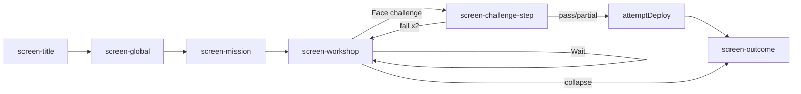
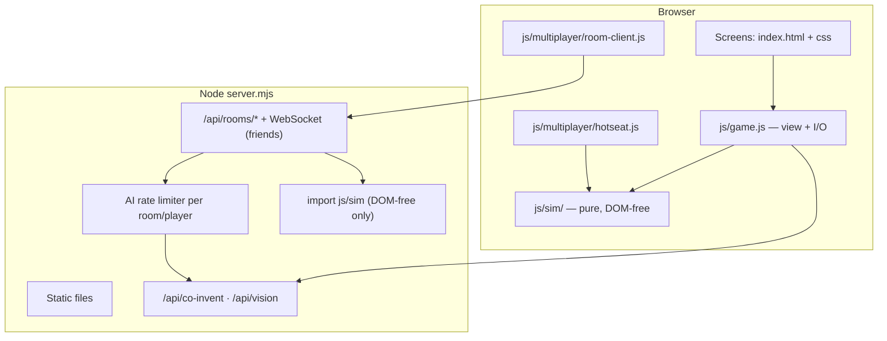
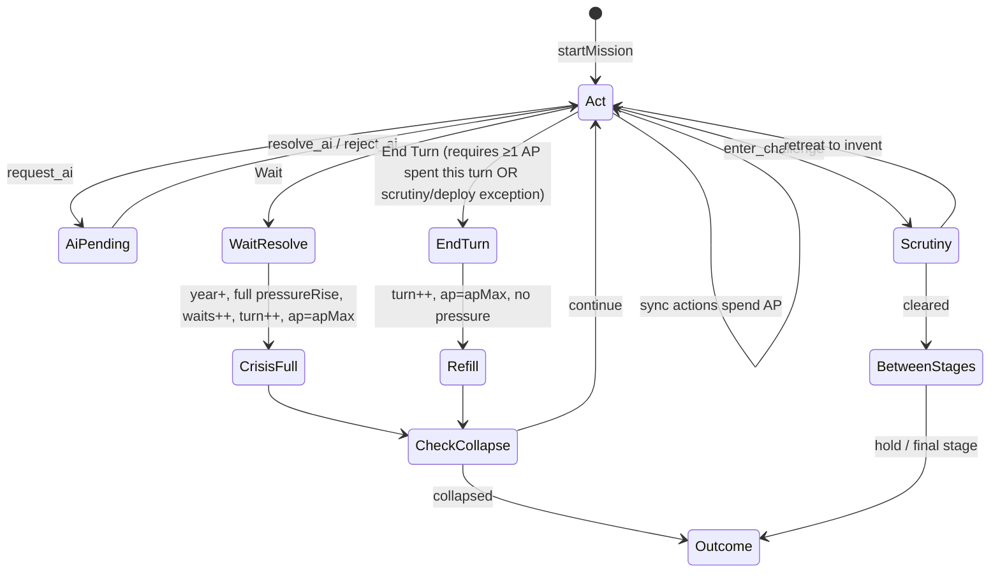
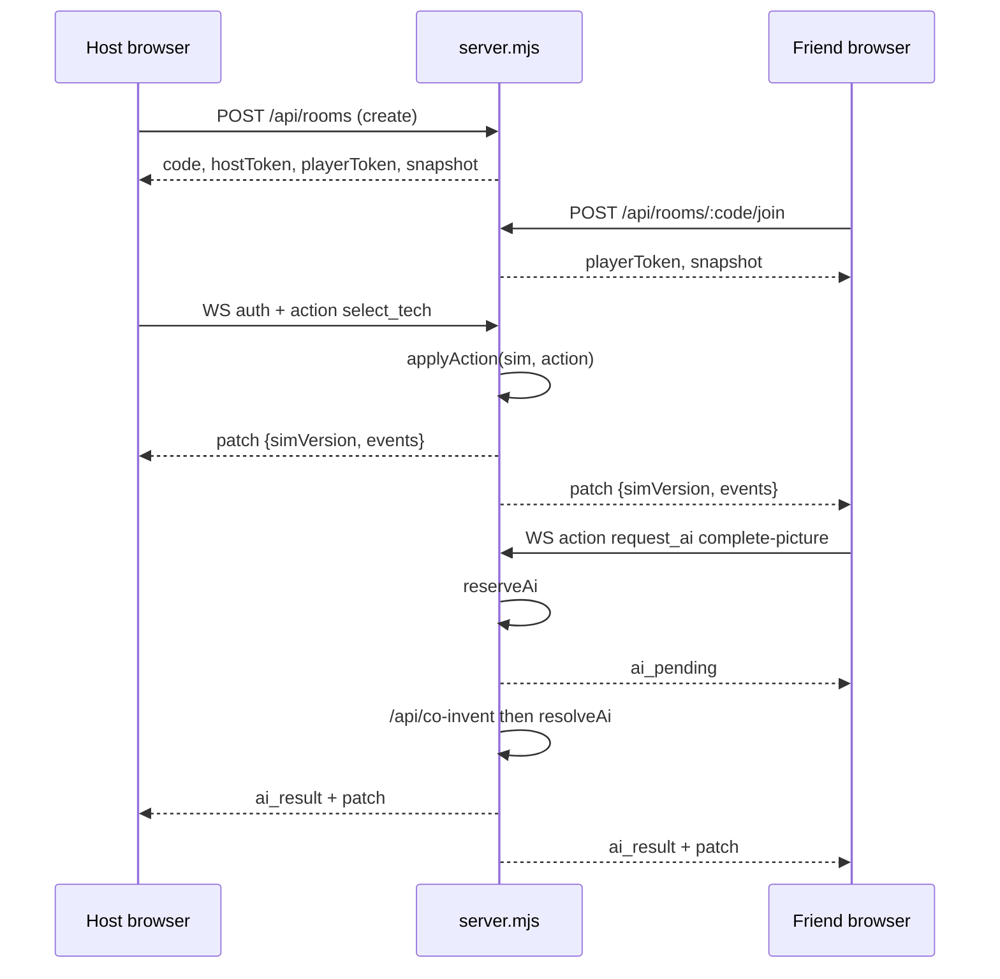
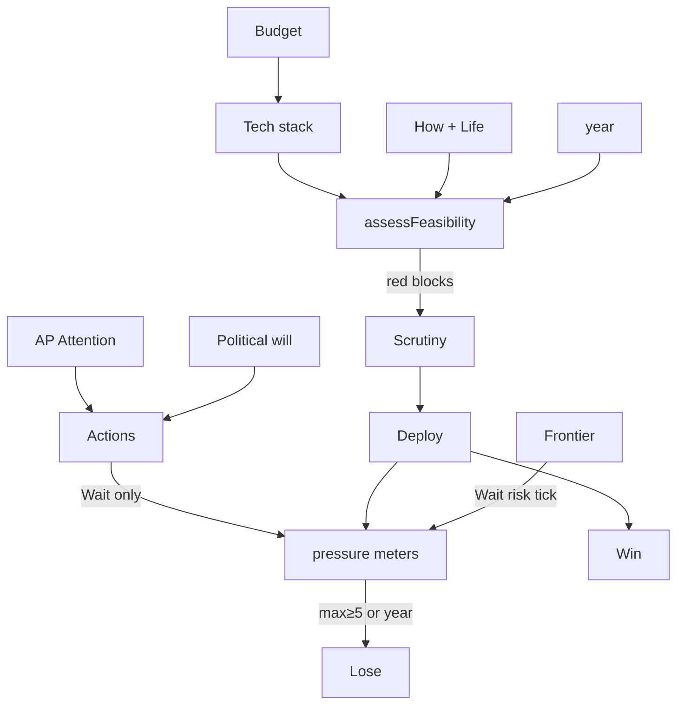

# Future Forge — Game Mechanics & Multiplayer Design

| Field | Value |
|-------|--------|
| **Title** | Future Forge: Solo Turn Economy & Friends Multiplayer |
| **Author** | Future Forge design (Grok) |
| **Date** | 2026-07-23 |
| **Status** | Draft (rev 5 — friends group multiplayer) |
| **Codebase** | `/mnt/data/dev/learning-game` (v1.1.0) |
| **North star** | Small team racing a local crisis; spend attention, capital, and political will; invent under time pressure; survive hostile scrutiny; clever stacks and honest timing beat generic futurism |

---

## Glossary (canonical naming — read first)

These names are **binding** for all code, UI copy, flags, and this document. Do not invent synonyms in implementation sketches.

| Concept | Code field | UI label | Never call it |
|---------|------------|----------|---------------|
| Crisis meters (0–5) | `state.pressure[key]` | The meter’s own name (e.g. Floods, **Trust**, Livelihoods) | “resources,” “will,” “player trust” |
| Political capital (0–5) | **`state.will`** | **Political will** | Trust, PW, influence, `state.trust` |
| Capital (0–10) | **`state.budget`** | **Budget** | money, gold, coins |
| Action points | **`state.ap`** / `state.apMax` | **AP** or **Attention** | energy, mana |
| Action rounds | **`state.turn`** | Turn N (action economy) | calendar steps |
| Wait count | **`state.waits`** | Waits used | turn |
| Calendar year | **`state.year`** | Year | turn |
| Feature: capital + will | **`GAME.features.budgetWill`** | — | `budgetTrust` |
| Feature: AP economy | **`GAME.features.actionPoints`** | — | — |

**Hard ban:** never introduce `state.trust` as a player resource. Mission crisis keys may still be the string `"Trust"` inside `state.pressure` — that is a **crisis meter**, not political will.

When this doc says “Trust” alone, it means a **crisis pressure key** (existing mission data). Player resource is always **political will** / `state.will`.

---

## Overview

Future Forge today is a compelling **solo browser learning loop**: theme → local mission → invent (tech stack + dual story faces) → feasibility light → single-essay challenge → deploy. Crisis meters rise on Wait; deploy drops them; collapse year or any meter ≥ 5 loses. There is no turn economy, no budget, no political will, no multi-stage deploy, and no multiplayer. Progress is `localStorage` only (`future-forge:scenarioCache`, `future-forge:solvedMissions`).

This design adds **real game mechanics** in five solo phases (G0–G4), then layers **multiplayer for a group of friends** (not a classroom). Priority: **live friends co-op rooms** (one shared invention, WebSocket) → optional hotseat → async friends studio → competitive race among friends → adversarial critic last. **Classroom / teacher tooling is a later commercial track**, not the multiplayer MVP. Solo action-point economy (G1) lands before networked multiplayer: multiplayer multiplies empty loops. Every mechanic is specified against existing symbols in `js/game.js`, `js/data.js`, `server.mjs`, and `index.html`.

---

## Background & Motivation

### Current architecture (as shipped)



| Concern | Current implementation |
|---------|------------------------|
| Game state | Single `state` object in `js/game.js` (L29–71) |
| Crisis | `state.pressure` 0–5; `waitTurn()` adds `mission.pressureRise`; `collapsed()` if year ≥ `collapseYear` or `maxPressure() >= 5` |
| Win | `wonMission()` — every pressure key ≤ `mission.winMax` after deploy |
| Deploy power | Exact formula in `attemptDeploy()` L1655–1665 (see **Deploy math** below); then highest-first allocation L1667–1683 |
| Challenge | One random `CHALLENGE_ANGLES` entry; single free-text answer; AI `pose-challenge` / `judge-challenge` |
| Feasibility | `assessFeasibility()` dims: timing, story, local fit, stack — any red → overall red → blocks challenge |
| AI | `POST /api/co-invent`, `POST /api/vision`; local fallbacks in `server.mjs` |
| Health | `GET /api/health` returns `{ ok, coInventor, vision, ai, auth, model, imageModel }` today; this design **adds** optional `rooms`, `features` |
| Persistence | `localStorage` scenario cache + solved mission ids only |
| Accounts / multiplayer | None |
| `game.js` size | 2404 lines |
| `TECHS` count | **29** entries (not “40+”) |
| `pressureRise` values | Almost exclusively `0` or `1` across all 16 static missions and generated packs |

### Deploy math (shipped baseline — authoritative)

```js
// js/game.js attemptDeploy() L1655–1665 — extract as computeDeployDrop(state)
let drop = 1 + Math.min(2, techs.length - 1);  // base 1 + stack bonus capped at +2
if (domains.length >= 2) drop += 1;             // cross-domain once
if (pairs.length) drop += 1;                    // any synergy pair: +1 total (not per pair)
if (words >= 40) drop += 1;                     // combined how+impact word count
if (state.challengeVerdict === "pass") drop += 1;
if (state.challengeAnswer.trim().length >= 60) drop += 1;
if (techs.filter((t) => suggested.has(t.id)).length >= 2) drop += 1;
```

```js
// L1667–1683 — extract as applyPressureDrop(pressure, drop)
// Sort keys by current pressure descending; distribute `drop` points,
// first pass taking up to ceil(remaining/2) per key, second pass −1 each.
```

`computeDeployDrop(state) → { drop, parts: [{ id, label, delta }] }` must match this baseline bit-for-bit under a feature-flag-off path. G2+ only **adds** named deltas to `parts`.

### Pain points

1. **Wait is the only “turn.”** Inventing, writing, co-inventor fills, and scouting cost nothing.
2. **Synergy and cross-domain are soft flavor.** Boolean +1 drop each — easy to ignore.
3. **Challenge is one essay gate.** Learning angles appear once.
4. **Deploy is a single button.** `VISION_STAGES` drive vision art only, not gameplay.
5. **No outcome depth for sharing with friends.**
6. **Friends multiplayer is a product goal** but sim is browser-local today; no rooms yet.

---

## Goals & Non-Goals

### Goals

1. Make inventing feel like **spending limited attention under rising crisis** (AP, then Budget / political will).
2. Make **Wait costs and synergy payoffs visible and consequential**.
3. Evolve challenge into **scrutiny combat** (Argue / Patch / Pivot) without losing the writing/learning core.
4. Stage deploy as **pilot → scale → new normal**, with explicit rules for vision stage driving.
5. Enable **friends co-op rooms** (first multiplayer product milestone): invite code, **one shared invention**, live WebSocket, shared sim + AI rate limits. Hotseat optional. Classroom/teacher tools are **out of multiplayer MVP scope**.
6. Migrate incrementally: feature flags, no big-bang rewrite.

### Non-Goals

- Full MMO / persistent world / public leaderboards as v1 multiplayer.
- **Classroom LMS, teacher dashboards, host grade/resolve, SSO** as multiplayer MVP (Education track later).
- Mandatory user accounts or SSO in G0–G2.
- Real-time twitch combat or physics.
- Replacing AI co-inventor with rules-only engine.
- Hard tech card locks by year.
- Rewriting vision pipeline except deploy-stage override when `deployStages` is on.
- Mobile-native apps.
- Prometheus stack in solo self-host v1 (structured logs first).

---

## Proposed Design

### Architecture target



**PR1 acceptance:** `js/sim/**` must import nothing from DOM, `document`, or `game.js`. `server.mjs` may `import` sim modules for room authority.

### Sync rules vs async AI (critical split)

Pure `applyAction` **cannot** call the network. Split the action surface:

| Kind | Examples | Engine | AP timing |
|------|----------|--------|-----------|
| **Sync rules** | `select_tech`, `deselect_tech`, `wait`, `end_turn`, `lobby`, `write_commit`, `deploy_stage`, `enter_challenge` (gate only), `scrutiny_move` with local-only judge fallback path | `applyAction(sim, action, actor) → { ok, sim, events, error? }` | Spend/refund inside apply |
| **Async intent** | `request_ai` (fill, scout art, pose, judge, assess, coach, chat that hits server) | Client or room server: validate → **reserve** AP + quota → call AI → `resolve_ai` / `reject_ai` | Reserve on request; commit on success; **full refund** on transport/5xx; **no refund** on 200 with weak content |

```mermaid
sequenceDiagram
  participant U as UI / student
  participant S as applyAction / room sim
  participant Q as AI quota
  participant AI as co-invent / vision
  U->>S: request_ai { mode, clientActionId }
  S->>S: validate role, AP, phase
  alt insufficient AP or quota
    S-->>U: reject (no spend)
  else ok
    S->>S: reserve AP + mark pending job
    S->>Q: consume request slot
    S->>AI: call (idempotent by clientActionId)
    alt success
      AI-->>S: result
      S->>S: resolve_ai apply proposals; finalize spend
      S-->>U: patch + ai_result
    else failure
      AI-->>S: error
      S->>S: reject_ai refund AP; release quota optionally
      S-->>U: reject + refund notice
    end
  end
```

**Idempotency:** every client mutation carries `clientActionId` (UUID). Server ignores duplicates after first commit. Solo client keeps an in-flight map the same way.

**Concurrent friends-room AI:** at most **one** room-wide AI job at a time for pose/judge; fill/scout may run per-player up to rate limit but serialize writes to the same field via soft locks (see field editing).

---

## Part A — Solo game-ness (phased)

### Phase G0 — Run report, stars, Wait costs, synergy payoffs

#### G0.1 Run report & stars

```js
// js/sim/scoring.js
/** @typedef {Object} RunReport
 * @property {1} v                    // schema version — bump when fields change
 * @property {number} stars           // 0–3
 * @property {number} speedScore      // 0–100
 * @property {number} honestyScore
 * @property {number} eleganceScore
 * @property {string[]} highlights
 * @property {object} raw             // waits, year, turn, verdict, stretchLevel, ...
 */
```

**Counters used for scoring (after G1 exists):**

| Field | Meaning | Speed / stars use? |
|-------|---------|-------------------|
| `state.waits` | Times player chose Wait | **Primary for speed** |
| `state.year` | Calendar | **Primary for ★★★** |
| `state.turn` | Action rounds (End Turn + Wait) | Debug / thrift only, **not** ★★★ gate |

**Star rules (G0 alone, pre-AP — `turn` still equals waits):**

| Stars | Conditions |
|-------|------------|
| ★★★ | `win` + `year <= startYear + yearsPerTurn` (typically deploy by 2028 if start 2026) + `waits <= 1` + timing green at deploy + challenge `pass` |
| ★★ | `win` without all of the above, **or** `partial` with drop ≥ 4 and challenge pass/partial |
| ★ | Other `partial`, **or** collapse with `raw.hadChallengeAttempt === true` |
| 0 | Collapse with no challenge attempt ever this run |

When G1 lands, **do not** redefine ★★★ in terms of `state.turn` (action rounds). Keep year/waits gates so multi-step invent is not punished.

**Sub-scores:**

- **Speed:** `100 - 30 * waits - 5 * max(0, (year - startYear) / yearsPerTurn - waits)` clamped 0–100. (Wait-heavy and late-year both hurt; End Turns free for speed.)
- **Honesty:** Prefer `state.aiTiming.level` if `forKey` matches current timing cache key; else `detectClaimStretch(...).level`. green=90, yellow=60. **+10** if `hasPilotLanguage(howText)` (new exported helper — see below). Do **not** import private `PILOT_LANGUAGE`. If a future host-only skip is ever added, **cap honesty at 70** — MVP friends rooms have **no** host force-pass of scrutiny.
- **Elegance:** +25 per synergy **pair** (cap 50) — **explicitly richer than deploy** (deploy only checks `pairs.length` truthiness for +1). +20 if ≥2 domains; +15 if ≥2 suggested; +15 if answer ≥ 80 words and verdict pass.

**Timing source note:** AI assess is debounced 1600ms (`scheduleAiTimingAssess`). For scoring at deploy, snapshot `feasibilityOverallAtDeploy` and `timingLevelAtDeploy` **inside** `attemptDeploy` / `attemptDeployStage` at click time so a late AI callback cannot rewrite stars.

**Collapse path:** `waitTurn` clears `challengePassed` / `challengeVerdict` (L1267–1268). Scoring must use `state.hadChallengeAttempt` (boolean set true on first submit) and `state.lastChallengeVerdict` (sticky, not cleared on Wait).

**Persistence:**

```js
const STORAGE_RUNS = "future-forge:runReports";
// { [missionId]: { bestStars, lastReport /* RunReport v:1+ */, count } }
```

Stored reports always keep `v`. Readers ignore unknown fields; writers migrate by recompute on next finish if `v < current`.

**Stars UI placement (product locked):** G0 first ship shows stars **only on the outcome screen** (`screen-outcome` / `renderOutcome`). Do **not** show stars on the mission grid in G0. Shareable run cards are **G4** (not G0).

#### Honesty helper (Issue 9)

```js
// js/data.js — export for scoring without leaking private regexes if preferred
export function hasPilotLanguage(text) {
  return /\b(pilot|trial|partnership|partner with|lab|research|limited|mapped corridor|geofenced|supervised|clinical|opt[- ]in|phase\s*1|prototype|with oversight|human[- ]in[- ]the[- ]loop)\b/i.test(
    text || ""
  );
}
// Optionally also export PILOT_LANGUAGE / ROUTINE_LANGUAGE — either path is fine;
// scoring must use an exported API, not a private const import.
```

#### G0.2 Clearer Wait costs

Extend `#btn-wait` / `#wait-report`:

1. **Pre-Wait strip:** predicted pressure after full `pressureRise`, years until collapse, meters that would reach ≥4 highlighted.
2. Worked example for `portside-floods`: rise `{ Floods:1, Livelihoods:1, Trust:0 }` → Wait from (2,2,1) → (3,3,1).

#### G0.3 Visible synergy payoffs

`renderSynergy()` shows deploy preview from shared `computeDeployDrop` + note that elegance scores pairs per-pair while drop is boolean +1.

**Files:** `js/game.js`, `js/sim/scoring.js`, `js/sim/deploy.js`, `index.html`, `css/styles.css`, `js/data.js` (`GAME.features.runReport`).

---

### Phase G1 — Action points (turn economy)

#### Resource model

```js
// Extended state
ap: 3,
apMax: 3,              // GAME.apMax
turn: 0,               // action rounds (End Turn or Wait)
waits: 0,              // calendar Waits only
turnPhase: "act",      // "act" | "ai_pending" | "scrutiny" | "between_stages"
actionsThisTurn: [],
hadChallengeAttempt: false,
lastChallengeVerdict: null,
pendingAi: null,       // { clientActionId, mode, reservedAp } | null
```

```js
export const GAME = {
  title: "Future Forge",
  tagline: "...",
  startYear: 2026,
  yearsPerTurn: 2,
  apMax: 3,
  features: {
    runReport: true,
    actionPoints: true,
    budgetWill: false,      // NOT budgetTrust
    scrutinyCombat: false,
    deployStages: false,
    multiplayer: false,
    hotseat: false,
  },
};
```

#### Crisis tick policy (resolved — Issue 1)

Shipped `pressureRise` values are almost always **0 or 1**. Therefore `ceil(rise/2)` is **not** a half-tick: `ceil(1/2) = 1` equals a full Wait rise. That policy is **rejected**.

| Action | Year | `state.waits` | `state.turn` | Pressure | AP |
|--------|------|---------------|--------------|----------|-----|
| **Wait** | `+= yearsPerTurn` | `+= 1` | `+= 1` | **Full** `pressureRise` (current `waitTurn` body) | set to `apMax` after resolve (all remaining AP **burned** as the cost of Waiting) |
| **End Turn** | unchanged | unchanged | `+= 1` | **No pressure change** | refill to `apMax` |
| Challenge / deploy | unchanged | unchanged | unchanged | per deploy drop rules | per catalog |

**Rationale:** End Turn is the “I spent attention inventing” beat without advancing the horizon or the crisis. Wait remains the only way to buy later world conditions — and the only automatic crisis escalation. This resolves former Open Question 2 in favor of **(a) no pressure on End Turn**.

**Worked example — `portside-floods`:**  
Start Floods 2, Livelihoods 2, Trust 1.  
- End Turn ×3: still (2,2,1), turn=3, waits=0, year=2026.  
- One Wait: year=2028, waits=1, turn=4, pressure (3,3,1).  
Appendix A updated to match.



#### Write commits (precise)

A **write commit** is any of:

1. `change` debounced **1500ms** after last keystroke on `#invention-name`, how, or life fields, **or**
2. `blur` on those fields if text differs from last committed snapshot, **or**
3. Explicit **“Lock draft”** control (optional UI; same commit).

Rules:

- First **2** successful commits per action-turn that change any field: **0 AP**.
- Further commits that change text: **1 AP** each; if AP=0, field stays editable but toast “End turn or Wait to keep editing for free” and changes are **buffered** until next turn’s free commits (no silent data loss — buffer flushes free on new turn).
- Commits that do not change normalized text: 0 AP always.
- Co-inventor `applyProposals` that writes fields counts as **1 commit** (uses free slot if available, else 1 AP already paid by `request_ai`).

#### Action catalog (complete)

| Action id | Kind | AP | Notes |
|-----------|------|-----|-------|
| `write_commit` | sync | 0×2 then 1 | See write commits |
| `select_tech` | sync | 1 to add | Max stack 6; block if AP<1 |
| `deselect_tech` | sync | 0 | G1 no refund; G2 50% budget refund same turn only |
| `request_ai` | async | reserve **1** (see modes below) | **All** server-bound co-invent modes, including free-text `chat` and every `QUICK_ACTIONS` mode |
| `open_learn` | sync | 0 first open/turn, else 1 | Learn stack modal only (no server) |
| `lobby` | sync | 1 | G1: log + toast; G2: budget/will effects |
| `enter_challenge` | sync | 1 | Gates: feasibility, not collapsed; sets phase `scrutiny`; emits event that **auto-enqueues** pose AI (see below) |
| `abandon_scrutiny` | sync | 0 | Free retreat to invent; **does not** increment `challengeFails` or miss budget |
| `challenge_submit` | async | reserve 1 | G0–G2 single essay judge; G3 superseded by moves |
| `scrutiny_move` | async or sync | 1 (Pivot also costs will in G2+) | G3 only |
| `deploy` / `deploy_stage` | sync | **0** | Deploy is the reward for clearing scrutiny, not an AP sink |
| `wait` | sync | **burns all remaining AP** (must have ≥0; always allowed if not collapsed; does not require prior spends) | Full crisis + year; turn++. **Blocked** in `scrutiny` and `between_stages` |
| `end_turn` | sync | 0 | Requires `apSpentThisTurn >= 1` **or** phase in `scrutiny`/`between_stages`; else blocked with “Do something or Wait” |

**AI mode costs (all go through `request_ai`):**

| Mode group | Reserved AP | Notes |
|------------|-------------|-------|
| `complete-picture`, `spark`, `suggest-stack`, `draft-*`, `chat`, `push-further`, `explain-techs`, `art-of-the-possible`, `assess-feasibility` (manual), `coach-challenge`, `draft-challenge` | 1 | Auto debounced `assess-feasibility` from typing remains **0 AP** (background) |
| `pose-challenge` (batch) | **0** (already paid by `enter_challenge`) | Auto-enqueued; see handoff |
| `judge-challenge` / `judge-scrutiny-move` | paid by submit/move | — |

#### `enter_challenge` → pose handoff (authoritative)

1. **Sync** `enter_challenge` succeeds → spend 1 AP, set `turnPhase = "scrutiny"`, clear prior answer UI fields, init `scrutiny` shell (empty encounters or single-essay placeholders).
2. Engine **immediately enqueues** `request_ai` with `{ mode: "pose-challenge", reservedAp: 0, clientActionId: newId, count: encounterCount }` (G0–G2: `count: 1`; G3: 2 or 3 from feasibility table). Solo client and room server both auto-fire this — player does not click twice.
3. **G3 batch:** prefer **one** `pose-challenge` call with `context.encounterCount = n` returning `encounters[]`. Fallback: n sequential jobs under the same room-wide AI lock.
4. **On pose success:** fill speech/question (and encounter HP). Player may Argue/submit.
5. **On pose failure (network/5xx):** keep phase `scrutiny`; apply existing **`localPose`** / server local pose fallbacks (`game.js` `localPose`, `server.mjs` local paths). **No AP refund** for `enter_challenge` (player already committed to the gate).
6. **Idempotency:** duplicate pose jobs with same logical enter id ignored.

**Wait AP burn:** intentional thrift — deciding to Wait ends the turn and discards unspent attention. Document in UI: “Wait ends your turn (unspent AP lost).”

**Stack thrash:** add costs 1 AP; remove free. Synergy scouting by add/remove is limited by AP — acceptable.

**Challenge spanning turns (G1 single-essay and G3):**

- Entering challenge spends 1 AP; if AP remains, player may submit same turn.
- If AP runs out mid-scrutiny, **End Turn** is allowed (exception above); encounters, speech, HP, and answers **persist** on `state.scrutiny` / challenge fields across End Turns.
- Wait during open scrutiny or `between_stages`: **blocked**.
- **`abandon_scrutiny` (free retreat):** return to invent / `turnPhase = "act"`. Does **not** increment `challengeFails`, does **not** count as a miss, does **not** set `hadChallengeAttempt` by itself. Sticky `lastChallengeVerdict` unchanged. Re-enter costs `enter_challenge` AP again and **re-poses** (new angles allowed). Only **miss budget** (G3) or **fail verdict** (G0–G2 essay) increments `challengeFails`. Matches today: leaving challenge is free; two fail verdicts force the existing invent-retry path (`enterChallenge` resets fails at ≥2 on re-entry after two fails).

#### Integration points

| Existing function | Change |
|-------------------|--------|
| `startMission` | Init ap, waits=0, sticky challenge flags |
| `onTechClick` | `select_tech` / `deselect_tech` |
| `CoInventor.runMode` / `sendChat` / `callCoInventMode` | All → `request_ai` |
| `waitTurn` | Full tick + waits++ + burn AP + turn++ |
| `enterChallenge` / submit | catalog costs; sticky attempt flags |
| `renderHud` | AP; optional waits |
| New | End Turn button |

**Solo `apMax` default: 3** (product locked). **Friends room default `apMax`: 3** (same scarcity; party session, not class period).

---

### Phase G2 — Budget, tech costs, political will

```js
budget: 5,   // 0–10
will: 3,     // 0–5  — NEVER state.trust
```

UI HUD: **Budget** · **Political will** beside **AP**.

#### Tech costs — derive defaults (29 techs)

**Balance goal (PR5 playtest target):** at mission start (`budget: 5`, `apMax: 3`) a player can field a **mixed 3-tech stack** (two domains) without lobby income — i.e. total tech budget cost ≤ 5 for a typical “mature + steep + steep” or “three mature” tray pick. Formula is a **starting point**, not sacred; expand overrides after one playtest pass.

Avoid hand-authoring every id. **Steep alone does not raise budget** (15/29 techs are `steep`; defaulting them all to 2 made the tray too harsh vs free stacking today):

```js
export function techCost(t) {
  // t: full tech object from TECHS
  const overrides = TECH_COST_OVERRIDES[t.id]; // sparse — preferred for outliers
  if (overrides) return overrides;
  let budget = 1; // mature and steep default
  let will = 0;
  let frontierRisk = 0;
  // Premiums from readiness / early curve only
  if (t.curve === "early") { budget = 2; will = 1; frontierRisk = 1; }
  if ((t.readyYear || 2026) >= 2030) {
    budget = Math.max(budget, 3);
    will = Math.max(will, 1);
    frontierRisk = Math.max(frontierRisk, 2);
  } else if ((t.readyYear || 2026) >= 2028) {
    frontierRisk = Math.max(frontierRisk, 1);
    budget = Math.max(budget, 2); // near-horizon premium, not all steep
  }
  return { budget, will, frontierRisk };
}

// Sparse overrides (expand after playtest). Examples:
// TECH_COST_OVERRIDES = {
//   quantum: { budget: 3, will: 1, frontierRisk: 2 },
//   ai: { budget: 2, will: 1, frontierRisk: 1 },
//   "quantum-internet": { budget: 3, will: 1, frontierRisk: 2 },
// }
```

On add: pay budget+will or block. On remove same turn: refund `floor(budgetCost/2)` budget; will not refunded.

#### Income table

| Event | Budget | Will |
|-------|--------|------|
| Mission start | 5 | 3 |
| Challenge pass / scrutiny cleared | +1 | +1 |
| Challenge fail | 0 | −1 (min 0) |
| Pilot deploy success | +2 | +1 |
| Lobby | −1 budget | +1 will (cap 5) |
| Wait | 0 | 0 (crisis meters may include Trust pressure separately) |

#### Feasibility Resources dim (Issue 15)

- Resources dim is **at most yellow** if budget ≤1 or will ≤1 while further paid actions remain desirable.
- **Never red** from Resources alone — overall feasibility must not hard-block challenge solely because capital is low when stack is already built (`any red → red` in `assessFeasibility` L938–943 would otherwise trap players).
- Implementation: `level: budget===0 && will===0 ? "yellow" : ...` — never `"red"`.

#### Frontier risk tick

- Condition: sum of `frontierRisk` on stack ≥ 3 **and** stretch level yellow/red at tick time.
- **On Wait only** (not End Turn) — risk is “world reacts to hype over time.”
- 20% chance +1 on highest crisis meter.
- RNG: `riskRng = mulberry32(hash(missionId + ':' + waits + ':' + roomSeed||'solo'))` so race/daily is reproducible; solo undeeded runs use `missionId+waits+turn`.

#### Deploy modifiers (G2 deltas on top of baseline formula)

**Final (no dual options).** Suggested-tech ≥2 remains **baseline-only** (already in `computeDeployDrop`). G2 adds exactly two deltas:

```js
// After baseline drop computed — G2 only when features.budgetWill:
if (state.will >= 4) drop += 1;                    // parts: { id: "mandate", delta: +1 }
if (state.will === 0) drop = Math.max(0, drop - 1); // parts: { id: "no_mandate", delta: -1 }
// Do NOT add suggestedPaidCount or any other G2 branch.
```

---

### Phase G3 — Scrutiny combat + staged deploy

#### Encounter setup

| Feasibility overall | Encounters | HP each |
|---------------------|------------|---------|
| green | 2 | 2 |
| yellow | 3 | 2 |
| (red blocked) | — | — |

Distinct angles via `pickChallengeAngles(n)` from `CHALLENGE_ANGLES`.

#### Move resolution table (authoritative)

| Move | AP | Other cost | Damage on success | On failure | Side effects |
|------|-----|------------|-------------------|------------|--------------|
| **Argue** | 1 | — | **hit** → 2 HP; **glance** → 1 HP; **miss** → 0 | Counts as 1 **miss** | Requires ≥20 chars; AI `judge-scrutiny-move` |
| **Patch** | 1 | optional 1 budget for “funded patch” (+1 dmg) | Always **1** HP if player accepts a patch text (≥1 sentence change to how or stack) | If player cancels | Proposal from AI **or** local template if quota empty; player must edit/accept |
| **Pivot** | 1 | **1 will** (G2+; if `budgetWill` off, skip will cost) | Clears encounter immediately (HP→0) | If will insufficient | Sets `encounter.pivoted=true`; elegance −15 once per run (not −1 star directly) |
| **Coach / Draft** | 0 first total in scrutiny, then 1 | — | 0 | — | Existing coach UX |

**Miss budget:** cumulative **miss** count across the whole scrutiny run. At **2 misses**, scrutiny fails → back to invent, `challengeFails++` (same as today’s 2-fail spirit). Glances do not count as misses. Hits do not reset miss count.

**Encounter clear:** HP ≤ 0 (via damage or Pivot).

**Run clear (unlock deploy):** **all** encounters cleared.  
**Pivot limit:** at most **one** Pivot per run; second Pivot blocked.  
**resolveTokens:** removed as a parallel currency — **simplify**: only “all encounters cleared” unlocks deploy. (Earlier dual formula was inconsistent.)

#### Between-stage / mid-run UI (v1 hard rules)

After scrutiny clears (or fac `resolve_scrutiny`) → `turnPhase = "between_stages"`, `deployUnlocked = true` (sticky until outcome or mission reset).

**Deploy bay** (workshop shell + banner is fine):

| Rule | v1 behavior |
|------|-------------|
| Allowed actions | `select_tech`, `deselect_tech`, writes / `write_commit`, `request_ai`, `open_learn`, `lobby`, `end_turn`, `deploy_stage`, Hold the line |
| **Wait** | **Blocked** until outcome screen or player abandons unlock via **Abandon mission** (collapse/pause path) — not via Return to invent |
| **Re-scrutiny** | **None** once `deployUnlocked` — even if stack/how change or feasibility goes yellow |
| Feasibility **red** | Block further `deploy_stage` until fixed (edit claims/stack); **do not** open new encounters |
| Return to invent | Cosmetic navigation only; `deployUnlocked` stays true; banner still shows next stage ready |
| After Pilot | Banner **Scale ready** + **Deploy Scale** + **Hold the line** → `finishOutcome("partial")` |
| After Scale | **Declare new normal** (win check, see drop rules) or **Hold the line** |
| HUD pills | Invent · Scrutiny · Pilot · Scale · New normal (CSS collapse to 3 labels on narrow) |

#### Vision stage driving (frozen choice)

When `GAME.features.deployStages === true`:

```js
function currentStage() {
  if (GAME.features.deployStages && state.deployStage) {
    const map = {
      none: "present",
      pilot: "prototype",
      scale: "transition",
      new_normal: "transformed",
    };
    const id = map[state.deployStage] || "present";
    return VISION_STAGES.find(s => s.id === id) || VISION_STAGES[0];
  }
  // legacy: tech-count thresholds (game.js L167–173)
  ...
}
```

`state.deployStage`: `none` → `pilot` → `scale` → `new_normal` after each successful stage step (new normal may be declare-only).

#### markMissionSolved

**Decision (resolved):** first successful **Pilot** (or single `deploy` if stages off) calls `markMissionSolved` — same spirit as today (“any successful deploy lands relief”). Holding the line after Pilot still counts solved.

#### Staged drop split (budget = one baseline deploy)

**Problem with prior split:** Pilot `ceil(full/2)` + Scale remainder **recomputed** + New normal `ceil(full/2)` again ≈ **1.5–3×** a single `attemptDeploy`, making `wonMission()` near-automatic on typical meter totals (~5–7).

**Authoritative rules:**

1. On scrutiny clear / fac resolve (when entering `between_stages`), **freeze**:
   ```js
   state.stagedDropPool = computeDeployDrop(sim).drop; // includes G2 will deltas at unlock time
   state.stagedDropRemaining = state.stagedDropPool;
   state.dropPilotApplied = 0;
   state.dropScaleApplied = 0;
   ```
   Do **not** recompute pool when stack grows later (stack growth can still improve vision/elegance stars, not crisis math).

2. **Pilot:**  
   `dropPilot = max(1, Math.ceil(stagedDropPool / 2))`  
   `dropPilot = min(dropPilot, stagedDropRemaining)`  
   `applyPressureDrop(pressure, dropPilot)`  
   `stagedDropRemaining -= dropPilot`; `dropPilotApplied = dropPilot`; `deployStage = "pilot"`.

3. **Scale:**  
   `dropScale = stagedDropRemaining` (i.e. `pool - dropPilotApplied`, may be 0 if pool was 1)  
   if `dropScale < 1` and pool ≥ 1 already spent, Scale still advances stage with **0** further drop (player “scales narrative” only)  
   else `applyPressureDrop(pressure, dropScale)`; `stagedDropRemaining = 0`; `deployStage = "scale"`.

4. **New normal:** **no additional crisis drop** by default. Action is a **win check only**:
   - if `wonMission()` → `finishOutcome("win")`
   - else → `finishOutcome("partial")` with copy that scale held but winMax not met  
   Optional **+1** drop only if `will >= 4` **and** `stagedDropPool` had been ≥ 4 (mandate encore) — single point, logged as `parts: new_normal_mandate`. Not a second half-pool.

5. **Total relief** across Pilot+Scale(+optional nn) ≤ `stagedDropPool` (+ at most 1 mandate encore) ≈ **one** baseline deploy.

**Numeric examples — `portside-floods` start pressure (Floods 2, Livelihoods 2, Trust 1), winMax typically low on Floods/Livelihoods:**

| `stagedDropPool` | Pilot | Scale | New normal | Max total drop | Notes |
|------------------|-------|-------|------------|----------------|-------|
| 4 | 2 | 2 | 0 (or +1 if will≥4 & pool≥4) | 4–5 | Honest single-deploy parity |
| 5 | 3 | 2 | 0–1 | 5–6 | |
| 6 | 3 | 3 | 0–1 | 6–7 | Can fully clear (2+2+1) if allocation hits all keys |
| 3 | 2 | 1 | 0 | 3 | Partial more likely; Hold-the-line still meaningful |

Allocation still uses existing highest-first `applyPressureDrop`.

---

### Phase G4 — Meta

| Feature | Design |
|---------|--------|
| Seeded dailies | `dailySeed = YYYY-MM-DD` → scenario salt |
| Pins | max 3 in `future-forge:pins` |
| Share cards | canvas/SVG; no server |

---

## Part B — Multiplayer (friends group)

**Product correction (rev 5, locked):** Multiplayer is for a **group of friends** inventing together — not a school classroom, not a teacher-led workshop. "Group learning" means social co-op under a shared crisis.

### Fantasy

> 2–5 friends join with a room code, pick a mission, and invent **one shared invention** under rising crisis meters — live on WebSocket. Roles are optional flavor; the stack, name, and story faces are shared. Win or fail together. Optional later: race the same seed for bragging rights among friends.

### Priority ladder (product locked — friends first)

1. **Friends co-op room (live WebSocket)** — first multiplayer product milestone  
2. **Hotseat / pass-and-play** — same friends, one device; optional before or after rooms  
3. **Async friends studio** — drop-in over days (later)  
4. **Competitive friends race** — same seed, invite-only (later)  
5. **Adversarial critic** (one friend plays Moloch) — last  
6. **Classroom / Education track** — *separate commercial product later*; not in this MVP  

**MP merge gate:** `actionPoints` feature stable **≥ 7 days** (or product sign-off) before default-on rooms.

**Session length:** flexible evening party (~30–90 min). No class-period script as core design.

### Invention model (product locked)

| Decision | Spec |
|----------|------|
| **One shared invention** | Single `selectedTechIds`, `inventionName`, `inventionHow`, `inventionImpact` for the room |
| Who can edit | Any seated player may act when they have AP (free-for-all on shared board), subject to field soft-locks |
| Optional roles | Cosmetic / soft preference only in MVP — do not hard-lock fields unless friends enable "role locks" in settings |
| Scoring | Shared run report + stars; optional personal "actions taken" vanity stats |

### Roles (optional, not teacher)

| Role id | Soft focus (if enabled) | Notes |
|---------|-------------------------|--------|
| `polymath` | stack, how-it-works, scout AI | Default seat name if no roles |
| `storyteller` | everyday life, name | |
| `diplomat` | lobby, stakeholder/ethicist Argue | needs `budgetWill` |
| `operator` | Wait/End Turn, Patch, deploy | |
| `host` | create room, pick mission, kick, end room | **Friend host** — light power only |

**No host gradebook. No host force-pass of scrutiny in MVP.**

Solo = all capabilities. Hotseat may rotate seats. Networked: first joiner is host; seats claim nicknames.

### Friends room defaults

```js
settings: {
  mode: "friends_coop",
  apMax: 3,                 // same as solo
  maxPlayers: 5,
  sharedInvention: true,    // locked true for v1
  roleLocks: false,         // free-for-all shared board
  scrutinyCombat: false,    // single-essay challenge default (party pace)
  deployStages: false,      // single deploy unless friends enable
  freeWrite: true,
  allowWait: true,
  hostCanKick: true,
  hostCanResolveScrutiny: false,  // MVP: friends must face the challenge
  allowRejoinByToken: true,
  allowRejoinByName: true,  // if disconnected seat + same displayName
}
```

### B1 Friends co-op rooms (first multiplayer product milestone)

#### Tokens & codes

| Secret | Entropy | Storage | Purpose |
|--------|---------|---------|---------|
| Room **code** | 6 Crockford chars (~30 bits) | Spoken / chat | Join locator only — **not** auth |
| `hostToken` | 128-bit random | sessionStorage | Host cmds only |
| `playerToken` | 128-bit random | sessionStorage | Auth for actions + WS |
| WS | First message `{ type:"auth", token }` | — | Bind socket to playerId |

**Host command allowlist:**  
`start_mission`, `set_settings` (limited), `kick`, `end_room`, `set_mission`.  
**Not in MVP:** `resolve_scrutiny`, `force_end_turn`, grade export.

#### Join / rejoin

`POST /api/rooms/:code/join` body:

```json
{ "displayName": "Alex", "playerToken": "<optional 128-bit hex>" }
```

| Case | Behavior |
|------|----------|
| Valid `playerToken` for this room | Restore seat; snapshot; reconnect WS |
| Token missing, `allowRejoinByName`, name matches **disconnected** seat | New token; reclaim seat |
| Name taken by **connected** seat | Reject `name_in_use` |
| New name | Join if `players.length < maxPlayers` |

Client stores `playerToken` in `sessionStorage`; show copyable recovery token once.

**Rate limits:** join 10/min/IP; create 5/hour/IP; WS auth fails 20/min/IP; AI quotas below.

**v1 topology:** single Node process (`ENABLE_ROOMS=1`).

#### Live protocol (WebSocket)



REST create/join + WS snapshot/patch/reject/ai_pending/ai_result.  
Every successful apply/resolve increments **`simVersion`**. Clients reject stale patches.

#### Shared invention concurrency

- All players act on the **same** sim fields.
- Soft lock: `POST`/`WS` `lock_field` { field: "inventionHow"|"inventionImpact"|"inventionName", ttlSec: 30 } — first claim wins; others see "Alex is editing How".
- Typing: optional `buffer_write` patches every 400ms while lock held; commit on blur or `write_commit` free action.
- If `roleLocks: true` (optional setting): map role → preferred fields; still one invention.

#### AI quotas (friends room)

| Scope | Default |
|-------|---------|
| Room session co-invent | 80 |
| Room vision | 12 |
| Per player / min | 4 |
| Per player / session | 25 |
| Reserved pose/judge | 20 of room budget |

### B1b Hotseat (optional)

Client-only `js/multiplayer/hotseat.js`. Pass device; shared invention; seats rotate. No server. Can ship before or after live rooms as capacity allows — **not** the product definition of multiplayer.

### B2–B5 (later)

| Mode | Notes |
|------|--------|
| Async friends studio | REST/SSE, 7-day TTL, team Wait when all ready |
| Friends race | Same seed, invite-only leaderboard, server-authoritative |
| Adversarial | One friend is Critic with challenge budget; last |
| Classroom / Education | Separate track: teacher dashboard, resolve controls, roster — **not designed in depth here** |

### Field editing MVP (friends)

**Decision:** MVP = **soft field locks** on shared invention fields + LWW for chat (if chat exists). No OT/CRDT.  
Optional `roleLocks` for friends who want structure.  
**No host unlock** — lock expires by TTL or peer "request unlock".

---

## How AP, Budget, and political will interact with pressure & feasibility



| System | Gate |
|--------|------|
| Feasibility red | Hard block enter challenge |
| Resources dim | Yellow only never red |
| AP=0 | Block paid actions; buffer writes |
| Budget | Hard block add tech |
| Will=0 | Pivot blocked; deploy drop −1 |
| Crisis key `"Trust"` | Independent of `state.will` |

---

## API / Interface Changes

### Sim modules

```js
// js/sim/state.js — createSimState(mission, global, opts) → SimState
// js/sim/actions.js — applyAction for SYNC only
// js/sim/ai_jobs.js — reserveAi / resolveAi / rejectAi helpers (pure state transitions)
// js/sim/deploy.js — computeDeployDrop, applyPressureDrop
// js/sim/scoring.js — scoreRun (RunReport v:1)
```

### Authoritative `SimState` v1 (WS snapshot / room authority)

`simVersion` lives on the envelope, not inside SimState: `{ simVersion: number, sim: SimState, players, you }`.

**In snapshot (server + hotseat serializable):**

| Field | Type | `createSimState` default | Cleared on Wait? |
|-------|------|--------------------------|------------------|
| `schemaVersion` | `1` | `1` | no |
| `screen` / logical phase | string | `"workshop"` | no |
| `turnPhase` | `"act"\|"ai_pending"\|"scrutiny"\|"between_stages"` | `"act"` | no (Wait blocked in scrutiny/between) |
| `globalId` | string | from mission | no |
| `mission` | object (normalized mission fields) | clone | no |
| `year` | number | `mission.startYear` | advances on Wait |
| `turn` | number | `0` | `+=1` on Wait and End Turn |
| `waits` | number | `0` | `+=1` on Wait |
| `pressure` | `Record<string, number>` | clone mission.pressure | rises on Wait |
| `selectedTechIds` | string[] | `[]` | no |
| `learnOrder` | string[] | `[]` | no |
| `inventionName` | string | `""` | no |
| `inventionHow` | string | `""` | no |
| `inventionImpact` | string | `""` | no |
| `storyFace` | `"how"\|"life"` | `"how"` | no |
| `domainFilter` | string | `"all"` | no |
| `ap` / `apMax` | number | `GAME.apMax` | refill on Wait/End Turn |
| `apSpentThisTurn` | number | `0` | reset on Wait/End Turn |
| `budget` / `will` | number | mission or 5 / 3 | no (lobby etc. change) |
| `actionsThisTurn` | array | `[]` | reset on Wait/End Turn |
| `pendingAi` | object\|null | `null` | no |
| `aiTiming` | object\|null | `null` | **yes** (same as today) |
| `challengePassed` | boolean | `false` | **yes** (today) |
| `challengeAngle` | string\|null | `null` | no required; may keep |
| `challengeText` / `challengeQuestion` / `challengeAnswer` / `challengeFeedback` | string | `""` | soft-clear optional |
| `challengeVerdict` | string\|null | `null` | **yes** clear live verdict |
| `challengeFails` | number | `0` | no |
| `hadChallengeAttempt` | boolean | `false` | **no** (sticky) |
| `lastChallengeVerdict` | string\|null | `null` | **no** (sticky) |
| `hostResolvedScrutiny` | boolean | `false` | no — **unused in friends MVP** (no host force-pass); reserved if Education track adds it later |
| `scrutiny` | object\|null | `null` | clear on Wait if abandon not used — prefer clear |
| `deployUnlocked` | boolean | `false` | no (Wait blocked while true in between_stages) |
| `deployStage` | `"none"\|"pilot"\|"scale"\|"new_normal"` | `"none"` | no |
| `stagedDropPool` / `stagedDropRemaining` / `dropPilotApplied` / `dropScaleApplied` | number | `0` | no |
| `outcome` | object\|null | `null` | — |
| `lastNews` / `waitReport` | string | `""` | overwritten on Wait |
| `featureFlags` | snapshot of relevant `GAME.features` | from room/solo | no |

**Never in SimState / snapshot (client-only):**

- `vision` (`VisionRenderer` instance, image URLs may be **side-cached** by room keyed by content hash, not in sim)
- `coInventor` UI instance / chat DOM
- DOM nodes, `$` handles, timers (`_aiTimingTimer`)
- `sideTab`, pure presentation
- Full `TECHS` array (ids only in state; catalog is static module)

**Patch ops:** `{ op, path, value }` against SimState; clients apply in `simVersion` order; gap → full snapshot resync.

### Health (additive)

```json
{
  "ok": true,
  "coInventor": true,
  "vision": true,
  "ai": true,
  "auth": "supergrok",
  "model": "grok-4.5",
  "imageModel": "grok-imagine-image",
  "rooms": false,
  "features": { "actionPoints": true, "rooms": false }
}
```

---

## Data Model Changes

Mission optional: `startingBudget`, `startingWill`, `apMax`.  
`normalizeMission` defaults.

Persistence keys: existing + `runReports` + `pins` + `settings`.

---

## Alternatives Considered

### Alt 1 — Time-only pressure (no AP)
Rejected as end state; G0-only is OK interim.

### Alt 2 — Deckbuilder tech draws
Rejected — fights literacy browsing and always-pickable categories.

### Alt 3 — P2P multiplayer
Rejected for unreliable NAT/P2P and centralized AI quota enforcement.

### Alt 4 — Shared doc multiplayer
Rejected as primary — no game.

### Alt 5 — Soft AP without End Turn pressure (and no hard End Turn)
AP regenerates on a timer or only gates AI/tech while writing is free forever; **no** End Turn button; crisis **only** on Wait (calendar turns only).

- **Pros:** Minimal cognitive load; matches current Wait mental model; no half-tick bug class.  
- **Cons:** Weak multiplayer role pacing; players infinite-dither before Wait; less “turn game.”  
- **Decision:** Rejected as default; End Turn **without** pressure (Issue 1 resolution) keeps invent pacing while Wait alone escalates crisis. Soft-AP remains a possible accessibility option later (`apMax: 99`).

### Alt 6 — Second essay slot instead of HP scrutiny combat
Two sequential essays (e.g. Moloch then Stakeholder), each pass/partial/fail, no HP/Argue/Patch/Pivot.

- **Pros:** Far simpler; fits a friends party session; reuses `pose-challenge`/`judge-challenge`.  
- **Cons:** Less “game feel”; fewer tactical verbs.  
- **Decision:** **Classroom default** effectively this (`scrutinyCombat: false` = single essay; optional setting `scrutinyEssayCount: 2`). Solo G3 may enable HP combat. HP combat is not required for MP MVP.

---

## Security & Privacy

| Threat | Severity | Mitigation |
|--------|----------|------------|
| API key exfil | Critical | Server-side only (existing) |
| Code brute force | Medium | TTL; **10 joins/min/IP**, **5/min/code** |
| Token theft | Medium | 128-bit tokens ≠ room code; sessionStorage; fac cmd matrix |
| AI cost bomb | High | Quotas + local fallback + fac pause |
| Student PII | Medium | Display names; no essay info logs default |
| XSS | Medium | `escapeHtml` on AI strings |
| Multi-instance split brain | Medium | **Single node v1** |
| License | Legal | COMMERCIAL.md multi-user |

---

## Observability (phased)

| Phase | What |
|-------|------|
| **G0–G2 solo** | Structured JSON **console** lines: `ff_event` with `type`, `missionId`, `outcome`, `stars`, `waits` — no Prometheus |
| **Rooms on** | Same + `room_create`, `join`, `ai_quota_hit`, `action_reject` |
| **Hosted commercial** | Optional metrics export (`ff_co_invent_requests_total`, etc.) behind `ENABLE_METRICS=1` |

Alerting only in hosted context.

---

## Rollout Plan

| Stage | Flag | Rollback |
|-------|------|----------|
| G0 | `runReport` | Hide outcome stars UI (stars never on mission grid in G0) |
| G1 | `actionPoints` | Free actions; Wait-only year/crisis (today) |
| G2 | **`budgetWill`** | Ignore costs |
| G3 | `scrutinyCombat` + `deployStages` | Single essay + single deploy |
| Rooms (friends) | server `ENABLE_ROOMS=1` | Disable routes — **first MP product flag** |
| Hotseat | `hotseat` | Hide menu — optional |

---

## Risks

| Risk | Severity | Mitigation |
|------|----------|------------|
| sim extract regression | High | PR0 tests + PR1 mechanical-only |
| AP punishes writers | Medium | Free commits; AI assess free; buffer |
| Naming Trust collision | Medium | Glossary; ban `state.trust` |
| Scrutiny length in party session | Medium | Default single essay; optional combat |
| AI bill | High | Room quotas |
| MP before G1 | High | Merge gate 7 days |
| Shared-edit conflicts | Medium | Soft locks + simVersion |

---

## Key Decisions

1. **Solo AP (G1) before networked multiplayer.**  
2. **Political will is `state.will` — never `state.trust`.** Crisis meters may use key `"Trust"`. Flag name **`budgetWill`**.  
3. **End Turn does not change pressure or year.** Only Wait full-ticks crisis and advances year. (`ceil(rise/2)` rejected — rises are 0|1.)  
4. **Speed / ★★★ scoring uses `waits` and `year`, not action-round `turn`.**  
5. **Server-authoritative sim for friends rooms / race; client for solo/hotseat.**  
6. **Scrutiny is writing-first; friends rooms default to single-essay, not HP combat.**  
7. **Deploy stages override `currentStage()` when feature on; else tech-count.**  
8. **Categories always pickable.**  
9. **Ephemeral single-node rooms v1.**  
10. **Adversarial critic last.**  
11. **Feature flags on `GAME.features`.**  
12. **Pilot (or single deploy) marks mission solved** — aligns with current `markMissionSolved` on any successful deploy.  
13. **Async AI is reserve → resolve/reject with AP refund on failure; pure `applyAction` stays sync.**  
14. **Friends MVP field model = soft locks on one shared invention, not OT.**  
15. **Auth = 128-bit player/host tokens; room code is only a locator.**  
16. **Deploy stage actions cost 0 AP.**  
17. **Wait burns unspent AP (intentional).**  
18. **`js/sim/**` must be DOM-free.**  
19. **Staged deploy total relief ≤ one frozen `stagedDropPool` (~one baseline drop); New normal is win-check only (+optional 1 mandate).**  
20. **No host force-pass of scrutiny in friends MVP** — friends clear challenges by play.  
21. **Deploy bay: no re-scrutiny; Wait blocked; red blocks deploy_stage only.**  
22. **Abandon scrutiny is free (no fail increment); re-enter re-poses.**  
23. **G2 deploy deltas only: will≥4 +1, will===0 −1.**  
24. **techCost: steep does not inflate budget; playtest target = 3-tech stack from starting 5 budget.**  
25. **First multiplayer product milestone is friends co-op rooms (live WS, shared invention), not classroom.**  
26. **Friends multiplayer is not classroom tooling** — Education track is separate and later.  
27. **Solo and friends-room `apMax` default is 3.**  
28. **G0 stars appear on the outcome screen only** — not the mission grid. Share cards are G4.  
29. **One shared invention per friends room** (product locked).  
30. **Live WebSocket for friends v1** (product locked).  

---

## Open Questions (product only)

Resolved answers are locked below.

1. ~~Audience~~ **Resolved → friends group**, not classroom.  
2. ~~End Turn crisis math~~ **Resolved → no pressure.**  
3. ~~Invention model~~ **Resolved → one shared invention.**  
4. ~~Live model~~ **Resolved → WebSocket party session.**  
5. ~~Stars placement~~ **Resolved → outcome screen only for G0.**  
6. ~~Solo / friends apMax~~ **Resolved → 3.**  
7. ~~MP order~~ **Resolved → friends rooms first**; classroom later/separate.  
8. Free chat in room, or action log only?  
9. Competitive race invite-only only, or public later?  
10. Brand name for multiplayer (“Forge Room”, “Party code”)?  
11. Optional role-locks setting default on or off for friends?  
12. Minimum age / writing expectation for free-write?  

---
## PR Plan (revised — friends first)

| PR | Title | Files | Depends | Description |
|----|-------|-------|---------|-------------|
| **PR0** | Add test harness | `package.json` (`node --test` or vitest), `js/sim/*.test.js`, `npm test` | — | No game behavior change. |
| **PR1** | Extract mechanical sim | `js/sim/pressure.js`, `deploy.js`, `collapse.js`, wire `game.js`; DOM-free | PR0 | Exact deploy drop + pressure allocation; parity tests. |
| **PR2** | G0 Run report & stars | `scoring.js`, outcome UI, RunReport `v:1` | PR1 | Stars on **outcome only**. |
| **PR3** | G0 Wait preview & drop breakdown UI | `game.js`, `index.html` | PR1 | |
| **PR4** | G1 AP + End Turn + request_ai | `js/sim/actions.js`, `ai_jobs.js`, HUD, coinventor | PR1, PR3 rec. | Wait burns AP; End Turn no pressure; flag `actionPoints`. |
| **PR5** | G2 Budget + political will | `techCost()`, HUD | PR4 | Flag **`budgetWill`**. |
| **PR6** | G3 Scrutiny combat | challenge UI, move table | PR5 prefer | Optional; friends default essay. |
| **PR7** | G3 Staged deploy | deploy bay, stage override | PR6, PR3 | Frozen drop pool. |
| **PR8** | G4 dailies/pins/share | client | PR2 | |
| **PR9** | Friends room protocol | REST create/join, WS auth, snapshot/patch, in-memory rooms, **no AI** | PR1, PR4, MP gate | Shared SimState; hostToken/playerToken. |
| **PR10** | Friends room AI + quotas | reserve/resolve proxy | PR9 | |
| **PR11** | Friends lobby + shared invent UI | nicknames, soft field locks, party HUD | PR10 | **First MP product milestone** |
| **PR12** | Hotseat (optional) | `hotseat.js` | PR4 | One device; after or parallel to PR11 |
| **PR13** | Async friends studio | REST/SSE | PR10 | |
| **PR14** | Friends race (invite seed) | leaderboard | PR10 | |
| **PR15** | Adversarial critic | | PR14, PR6 | Off by default |
| **Later** | Education / classroom track | teacher tools | separate | Not blocking friends MP |

**First solo milestone:** PR0–PR4.  
**First multiplayer product milestone:** **PR9 → PR10 → PR11** (friends co-op).  
**Hotseat:** optional. **Classroom:** later commercial track.

---
## Implementation notes (symbols)

| Symbol | File | Notes |
|--------|------|-------|
| `state` L29–71 | game.js | Extend; never `state.trust` resource |
| `waitTurn` L1232 | game.js | Only full crisis path; set `waits` |
| `attemptDeploy` L1655–1683 | game.js | Split drop + allocate |
| `assessFeasibility` L850+ | game.js | Resources dim ≤ yellow |
| `currentStage` L167–173 | game.js | Override when deployStages |
| `PILOT_LANGUAGE` L1358 | data.js | **private** — use `hasPilotLanguage` export |
| `FRONTIER_CLAIM_PATTERNS` | data.js | exported |
| `detectClaimStretch` | data.js | exported |
| `CHALLENGE_ANGLES` | data.js | deck |
| `VISION_STAGES` | data.js | present/prototype/transition/transformed |
| `TECHS` | data.js | **29** techs |
| `CoInventor` / `sendChat` / `runMode` | coinventor.js | all → request_ai |
| `GET /api/health` | server.mjs | additive fields only |
| Storage keys | game.js L73–74 | pattern for new keys |

---

## References

- Codebase: `js/game.js`, `js/data.js`, `js/coinventor.js`, `js/vision.js`, `server.mjs`, `index.html`
- `README.md`, `COMMERCIAL.md`, `LICENSE.md`
- Review: `/tmp/grok-1000/grok-design-review-9b85533d.md` (rev 2 addresses Issues 1–18)

---

## Appendix A — Example turn (G2 solo, corrected)

Mission: `portside-floods`. Start year 2026, pressure Floods 2 / Livelihoods 2 / Trust 1, rise 1/1/0. AP 3, Budget 5, Will 3.

1. Select Solar (1 AP, 1 Budget), Battery (1 AP, 1 Budget). AP 1, Budget 3.  
2. Write how (free commits). `request_ai` complete-picture (1 AP) → AP 0.  
3. **End Turn** → turn=1, waits=0, year=2026, pressure **unchanged** (2,2,1), AP=3.  
4. Scout art-of-the-possible (1 AP). Lobby (1 AP, −1 Budget, +1 Will). End Turn → turn=2.  
5. `enter_challenge` (1 AP). Submit / scrutiny moves over this and next End Turns as needed; Wait blocked while in scrutiny.  
6. Pilot deploy (0 AP): apply drop; `markMissionSolved`; optional continue Scale.  
7. Stars: with waits=0 and year=2026 and pass+green → ★★★ candidate.

## Appendix B — Friends party session (~60 min example)

Uses **friends defaults**: `apMax: 3`, shared invention, single essay, live WS, no host force-pass.

| Min | Activity |
|-----|----------|
| 0–5 | Host creates code; friends join with nicknames; pick mission |
| 5–25 | Shared stack + story faces (soft locks); AI fill costs AP |
| 25–35 | Feasibility green/yellow; lobby if budgetWill on |
| 35–50 | One shared challenge essay; coach/draft optional |
| 50–55 | Deploy + shared vision |
| 55–60 | Outcome stars debrief; brag / rematch |

Evening can run longer with Wait cycles and optional scrutiny combat.

---

*End of design document — Status: Draft rev 5 (friends group multiplayer) — 2026-07-23*
